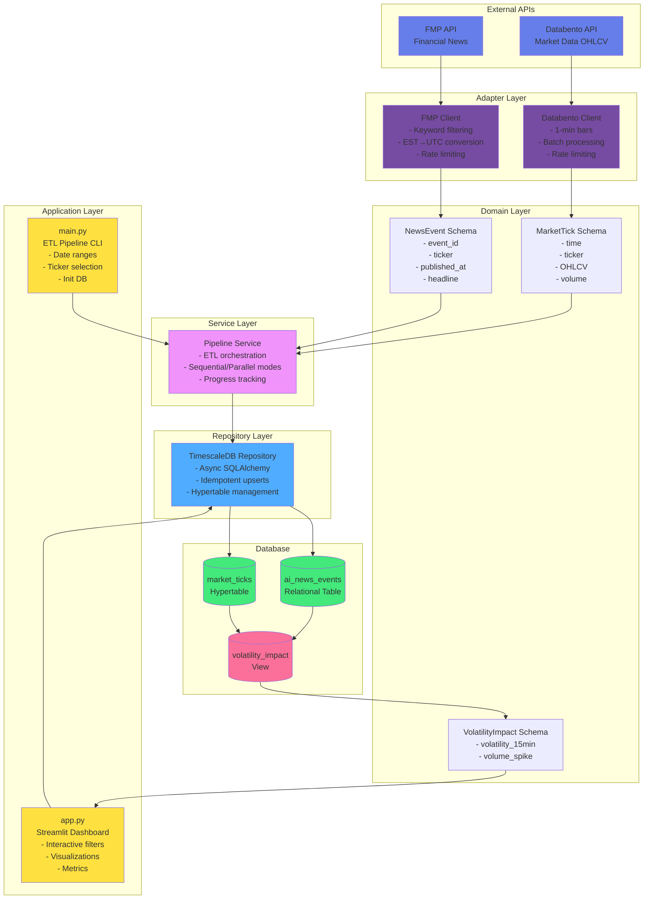
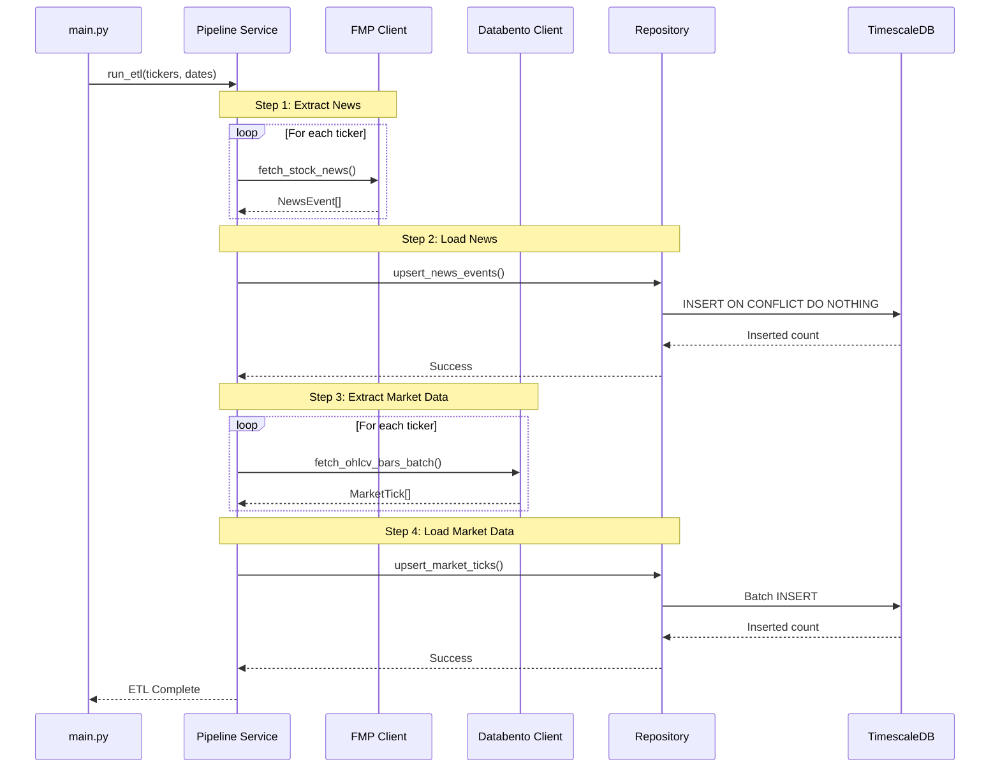
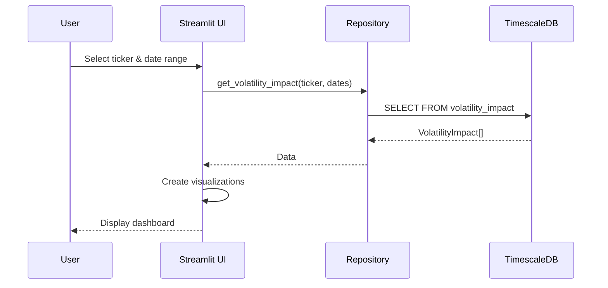
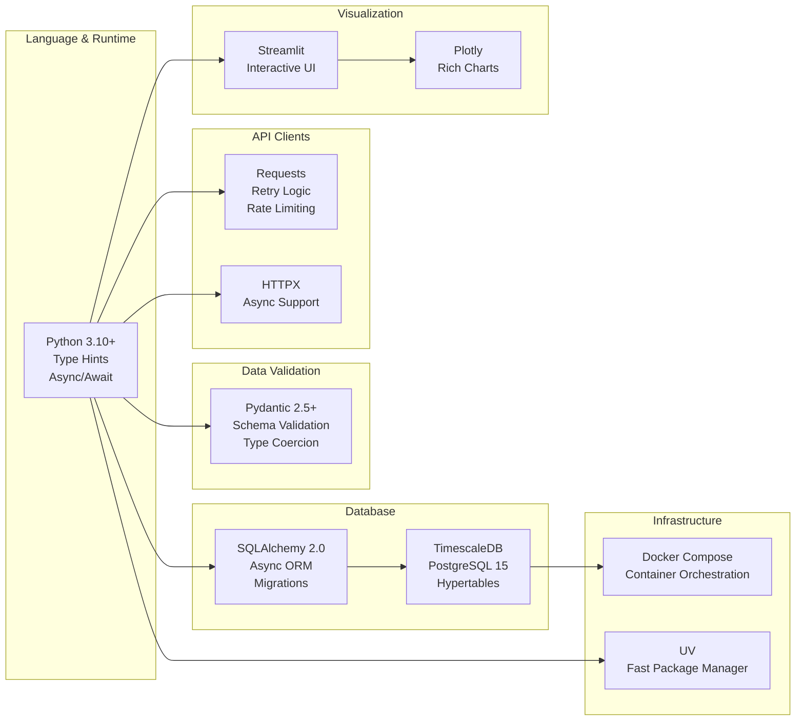

# AINewsQuake Architecture Diagram



## Data Flow

### ETL Pipeline (main.py)



### Dashboard Query Flow (app.py)



## Technology Stack



## Design Patterns

### Repository Pattern
```
┌─────────────────────────────────────────┐
│         Service Layer                   │
│  (Business Logic - Pipeline Service)    │
└─────────────────┬───────────────────────┘
                  │ Depends on
                  ▼
┌─────────────────────────────────────────┐
│      Repository Interface                │
│  (Abstract CRUD Operations)              │
└─────────────────┬───────────────────────┘
                  │ Implements
                  ▼
┌─────────────────────────────────────────┐
│   TimescaleDB Repository                 │
│  (Concrete Implementation)               │
└─────────────────┬───────────────────────┘
                  │ Accesses
                  ▼
┌─────────────────────────────────────────┐
│         Database                         │
│  (TimescaleDB - Data Storage)            │
└─────────────────────────────────────────┘
```

### Dependency Injection
```python
# Service accepts dependencies
pipeline = PipelineService(
    fmp_client=FMPClient(api_key),      # Injected
    databento_client=DatabentoClient(api_key),  # Injected
    repository=TimescaleRepository(db_url)      # Injected
)

# Easy to test with mocks
pipeline_test = PipelineService(
    fmp_client=MockFMPClient(),
    databento_client=MockDatabentoClient(),
    repository=MockRepository()
)
```

## Key Features

### Idempotency
```sql
-- News events: unique constraint prevents duplicates
INSERT INTO ai_news_events (...)
ON CONFLICT (ticker, published_at, headline)
DO NOTHING;

-- Market ticks: primary key prevents duplicates
INSERT INTO market_ticks (...)
ON CONFLICT (time, ticker)
DO NOTHING;
```

### Time-Series Optimization
```sql
-- Convert to hypertable (automatic partitioning)
SELECT create_hypertable(
    'market_ticks',
    'time',
    chunk_time_interval => INTERVAL '1 day'
);

-- Efficient time-range queries
SELECT * FROM market_ticks
WHERE time BETWEEN '2025-01-01' AND '2025-01-31'
  AND ticker = 'NVDA';
```

### Volatility Calculation
```sql
-- 15-minute window after news event
SELECT
    ne.event_id,
    MAX(mt.high) - MIN(mt.low) AS volatility_15min
FROM ai_news_events ne
LEFT JOIN market_ticks mt
    ON ne.ticker = mt.ticker
    AND mt.time BETWEEN ne.published_at 
                    AND ne.published_at + INTERVAL '15 minutes'
GROUP BY ne.event_id;
```

---

**Architecture designed for scalability, maintainability, and type safety** 🏗️
